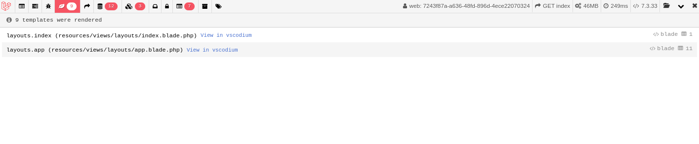
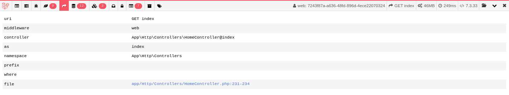

# laravel-debugbar-vscode

Plugin **laravel-debugbar** that provide **button** to open **vscode**

This package code is based on https://github.com/barryvdh/laravel-debugbar

## How to use

Click on the link (View in vscodium) as below :D



Click on the link (
app/Http/Controllers/HomeController.php:231-234) as below :D



## Installation

Require this package with composer. It is recommended to only require the package for development.

```shell
composer require oliveiraxavier/laravel-debugbar-open-ineditor --dev
```

In .env file set your preferred text editor or IDE (phpstorm | vscode | vscodium | etc)

```shell
DEBUGBAR_EDITOR=vscodium
```

### Laravel 5.5+:

Laravel 5.5 uses Package Auto-Discovery, so doesn't require you to manually add the ServiceProvider.

If you don't use auto-discovery, add the ServiceProvider to the providers array in config/app.php

```php
ErlangParasu\DebugbarVscode\ServiceProvider::class,
```

### Lumen:

For Lumen, register a different Provider in `bootstrap/app.php`:

```php
if (env('APP_DEBUG')) {
    $app->register(ErlangParasu\DebugbarVscode\LumenServiceProvider::class);
}
```

All credits to https://github.com/erlangparasu/laravel-debugbar-vscode
